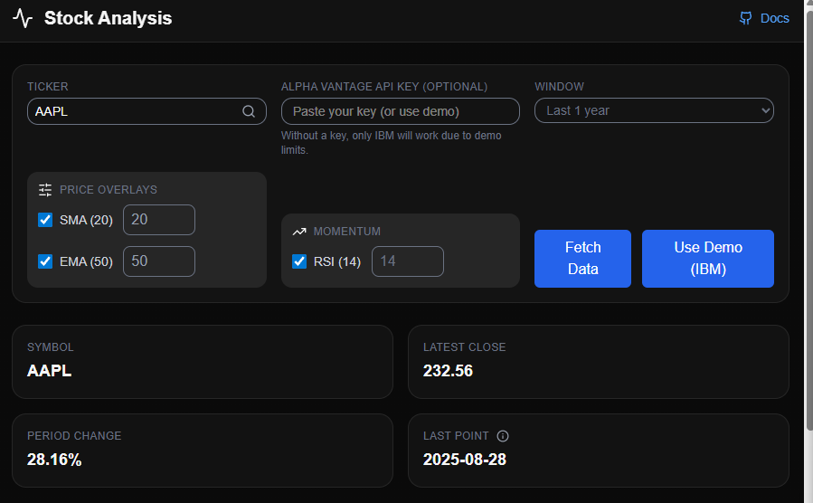
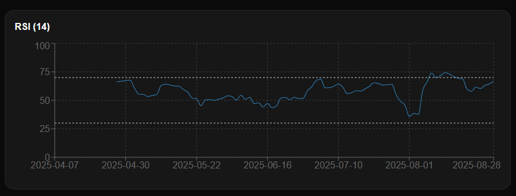
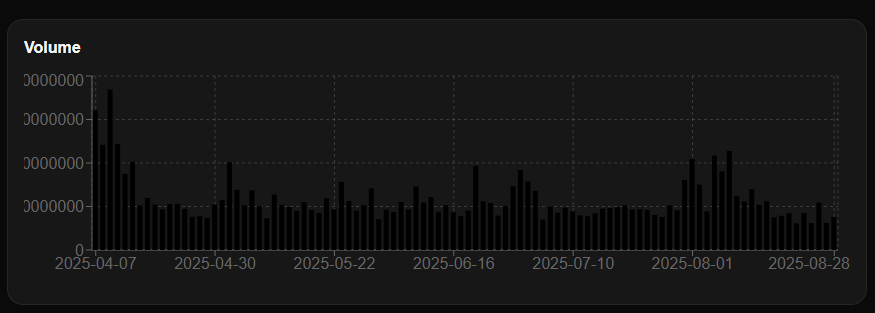
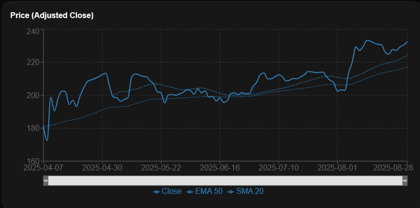

# 📊 Stock Analysis App

A React-based stock market analysis dashboard that allows users to visualize stock prices, apply technical indicators (SMA, EMA, RSI), and explore historical trends with interactive charts.


### ⚡ Built for educational purposes only — not financial advice.


## 🚀 Features
- 🔍 Stock Search – Search and load real-time/historical stock data.

- 📈 Interactive Charts – Line charts with zoom/brush controls.

- 📊 Technical Indicators

    - SMA (Simple Moving Average)

    - EMA (Exponential Moving Average)

    - RSI (Relative Strength Index)

- 📦 Data Source – Alpha Vantage
 (Free Tier API).

- 📱 Responsive UI – Works on desktop and mobile.

- 🔒 Privacy & Terms – Modal-based disclaimer with auto-close option.

##  🛠️ Tech Stack

- **Frontend** : React, Tailwind CSS, Recharts, Framer Motion

- **API**: Alpha Vantage (free stock data API)

- **State Management**: React Hooks

## 📂 Project Structure

```bash
src/
├── api/
│   └── alphaVantage.js       # API functions to fetch stock data
├── assets/                   # Images, icons, or static files
├── components/
│   ├── graphs/               # Chart Components
│   │   ├── PriceChart.jsx    # Stock price line chart
│   │   ├── RSIChart.jsx      # Relative Strength Index chart
│   │   ├── VolumeChart.jsx   # Volume bar chart
│   ├── Footer.jsx            # Footer with Privacy & Terms modal
│   ├── Header.jsx            # Header with search & navigation
│   ├── Label.jsx             # Custom labels for charts
│   ├── Stat.jsx              # Stats display (SMA, EMA, Close, etc.)
│   └── Toggle.jsx            # Theme/Chart toggle component
├── utils/
│   ├── indicators.js         # Functions for SMA, EMA, RSI calculations
│   └── useDebounce.js        # Custom debounce hook
├── App.css                   # Global styles
├── App.jsx                   # Main app component
├── index.css                 # Base styling
├── main.jsx                  # Entry point (React DOM render)
```

## ⚡ Getting Started

### 1. Clone the Repository
```bash
git clone https://github.com/madhavkumarjha/stock-analysis.git
cd stock-analysis
```
### 2. Install Dependencies
```bash
npm install
```

### 3. Add Environment Variables
Create a **.env** file in the root:
```bash
REACT_APP_ALPHA_VANTAGE_KEY=your_api_key_here
```


Get a free API key from [Alpha Vantage](https://www.alphavantage.co/) .

## 📸 Screenshots
#### All controls for this project with optional API key or demo Key  


#### RSI graph


#### Volume graph


#### Close , EMA & SMA graph



## 📜 Disclaimer
This application is for **educational purposes** only.
It should not be considered financial advice. Always do your own research before making investment decisions.